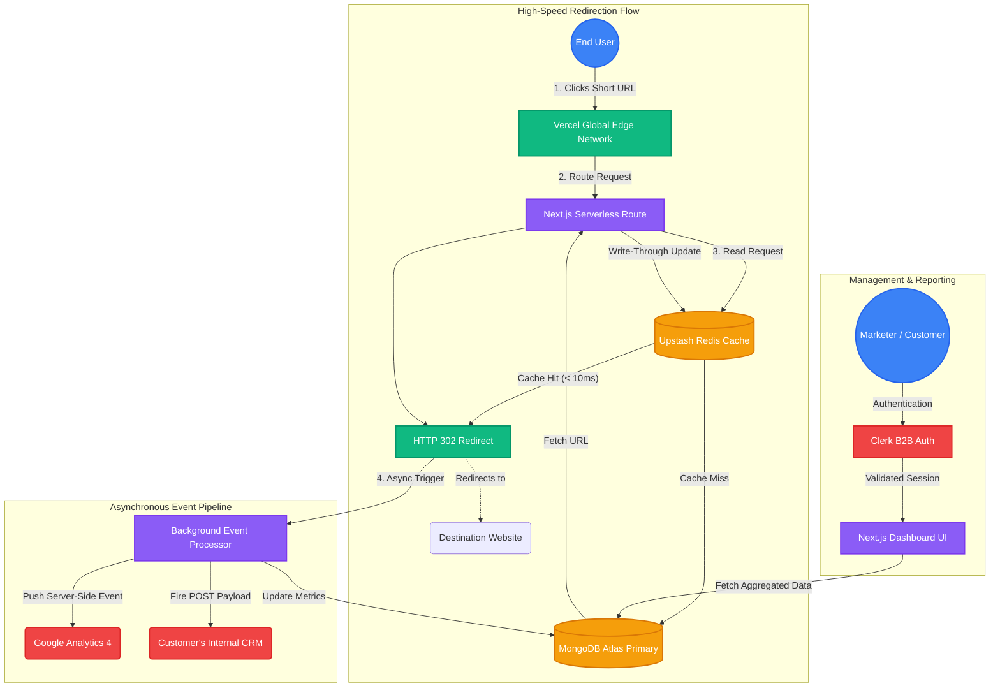

# Brua URL Shortener: System Architecture

*Use this diagram during your interviews to visually explain the data flow, caching strategy, and asynchronous analytics pipeline of your application.*

## How to Explain This Diagram

When an interviewer asks how the system works, break it down into these three sections:

### 1. High-Speed Redirection Flow (The Core)
> "When a user clicks a short link, the request hits Vercel's Edge Network. To achieve sub-10ms global redirects, the Next.js Serverless function immediately queries **Upstash Redis**. If it's a Cache Hit, we redirect the user instantly. If it's a Cache Miss, we query **MongoDB**, execute a Write-Through back to Redis so the next click is fast, and then redirect the user."

### 2. Asynchronous Event Pipeline (The Analytics)
> "Redirecting the user is priority #1, so analytics are processed *asynchronously* so they never slow down the redirect. Once the redirect fires, a background process updates the click count and geographic metrics in **MongoDB**, pushes a server-side event to **Google Analytics 4 (GA4)** via the Measurement Protocol, and fires a real-time **Webhook** payload to the customer's CRM."

### 3. Management & Reporting (The B2B SaaS Layer)
> "For the marketing teams using the product, all authentication and multi-tenant workspace isolation is handled by **Clerk**. Once authenticated, they access the Next.js Dashboard which fetches real-time aggregated metrics directly from MongoDB."
